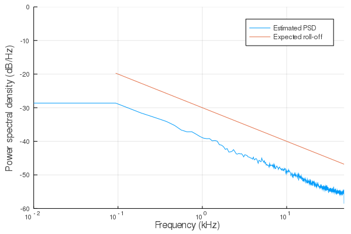
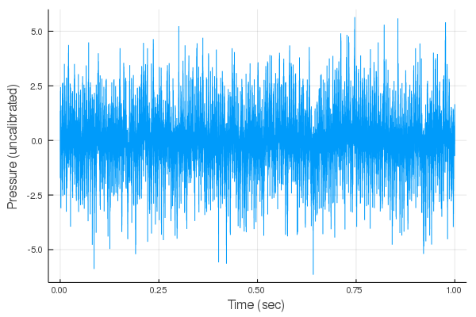
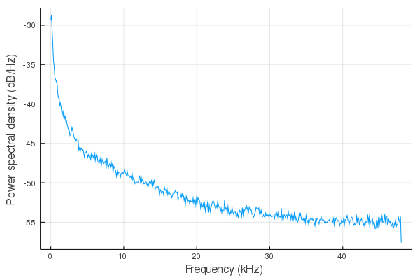

# ShipNoiseGenerators

[](https://travis-ci.org/ymtoo/ShipNoiseGenerators.jl)
[](https://codecov.io/gh/ymtoo/ShipNoiseGenerators.jl)


This library provides functions to generate
- [pink noise](https://ccrma.stanford.edu/~jos/sasp/Example_Synthesis_1_F_Noise.html) (`rand`)
- ship noise (`rand`)

## Installation
```julia
using Pkg; pkg"add https://github.com/ymtoo/ShipNoiseGenerators.jl.git"
```

## Usage
```julia
julia> using DSP, ShipNoiseGenerators, Plots

julia> n = 96000

julia> fs = 96000.0

julia> g1 = PinkNoiseGenerator(n)

julia> x = rand(g1)

julia> p = welch_pgram(x, 1024; fs=fs)

julia> plot(freq(p)./1000, 10*log10.(power(p)), xscale=:log10, xlims=(10, 48000)./1000, ylims=(-60, 0), xlabel="Frequency (kHz)", ylabel="Power spectral density (dB/Hz)", label="Estimated PSD")

julia> plot!(freq(p)./1000, 10*log10.(1 ./ (freq(p))), xscale=:log10, xlims=(10, 48000)./1000, ylims=(-60, 0), xlabel="Frequency (kHz)", ylabel="Power spectral density (dB/Hz)", label="Expected roll-off")
```



```julia
julia> n = 96000

julia> fs = 96000.0

julia> As = [0.8]

julia> frequencies = [200.0]

julia> ϕs = [0.1]

julia> g2 = ShipNoiseGenerator(n=n, fs=fs, As=As, frequencies=frequencies, ϕs=ϕs)

julia> x = rand(g2)

julia> plot([1:length(x)]./fs, x, xlabel="Time (sec)", ylabel="Pressure (uncalibrated)", legend=false)
```


```julia
julia> p = welch_pgram(x, 1024; fs=fs)

julia> plot(freq(p)./1000, 10*log10.(power(p)), xlabel="Frequency (kHz)", ylabel="Power spectral density (dB/Hz)", legend=false)
```


### Credits
Julia code by [@ymtoo](https://github.com/ymtoo) and [@mchitre](https://github.com/mchitre).
